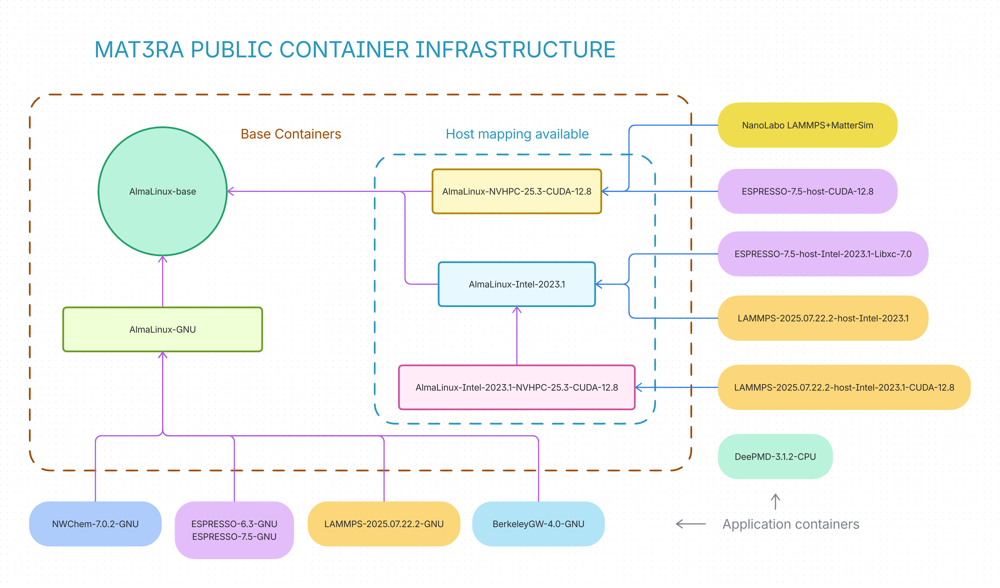

# Mat3ra application containers (public)

This repository contains Apptainer (Singularity) definitions of Mat3ra public
application containers. Containers are built automatically via GitHub workflow
and are hosted on GitHub Container Registry.



## How to download images?

Images are packaged as SIF (ORAS) files and are hosted on GitHub Container
Registry. Please find the list of images under [packages](
https://github.com/orgs/Exabyte-io/packages?repo_name=application-containers-public),
select the appropriate `tag`, and copy its URL. We can use `apptainer pull`
command to download images. For example, to download GNU build of Quantum
ESPRESSO v6.3, we can use the following command:
```console
apptainer pull oras://ghcr.io/exabyte-io/application-containers-public/espresso:6.3-gnu-0
```

## How to run containers?

We can use `apptainer exec` command to run applications packaged in containers.

```console
apptainer exec <image>.sif <command>
apptainer exec espresso-6.3-gnu-0.sif pw.x -in pw.in > pw.out
```

We can map host directories to the container using `--bind` directive if needed.

```console
apptainer exec --bind /path/to/host:/path/to/container <image>.sif <command>
apptainer exec --bind /export espresso-6.3-gnu-0.sif pw.x -in pw.in > pw.out
```

Use `--nv` flag to enable NVIDIA GPU support.

```console
apptainer exec --nv <image>.sif <command>
```

## How to add new application container?

1. Create apptainer definition file under the corresponding application
directory
2. Bootstrap from existing base images wherever possible
3. Add new container entry to `manifest.yml` to built images automatically via
GitHub workflow
4. Use application version as tag, followed by dependency/<wbr/>toolchain
version information. Finally, add `-N` numeric suffix to denote the build
iteration starting from 0. New builds are triggered when the tag is updated.
5. For large dependencies like Intel OneAPI or NVIDIA HPC SDK, we can use
apptainer `--bind` directive to map the host installation to the container.
6. Finally, to add an application to the Mat3ra platform, create a pull request
to the [standata](https://github.com/Exabyte-io/standata) repository with the
new application configuration data under
`standata/assets/applications/applications` directory (please refer to existing
configurations for reference).

## Managing ENV variables

Apptainer manages ENV variables with a number of shell scripts under
`/.singularity.d/env`:
```console
# ls -l /.singularity.d/env
total 10
-rwxr-xr-x 1 root root 1337 Aug  1 01:32 01-base.sh
-rwxr-xr-x 1 root root   85 Aug  1 01:32 10-docker2singularity.sh
-rwxr-xr-x 1 root root 1707 Dec  6 06:18 90-environment.sh
-rwxr-xr-x 1 root root    0 Dec  6 06:09 94-appsbase.sh
-rwxr-xr-x 1 root root 3052 Aug  1 01:32 95-apps.sh
-rwxr-xr-x 1 root root 1568 Aug  1 01:32 99-base.sh
-rwxr-xr-x 1 root root  922 Aug  1 01:32 99-runtimevars.sh
```
`90-environment.sh` is where the variables from `%environment` definition goes.
Above files are generated every time a new container is built, they are not
preserved from the base images. However, if we write variables to any other
file under `/.singularity.d/env`, they are preserved and sourced in runtime.
Notice the numerical prefix, that determines the order of sourcing. We can
write custom ENV variables to `$APPTAINER_ENVIRONMENT` in the `%post` section,
it will save them to `91-environment.sh`. This file will be sources runtime
automatically, if we need these variables runtime, we can source manually:
```console
if [ -f /.singularity.d/env/91-environment.sh ]; then
    . /.singularity.d/env/91-environment.sh
fi
```

1. Write ENV variables to `$APPTAINER_ENVIRONMENT` in base images.
```console
echo 'export ONEAPI_ROOT=/opt/intel-2023.1' >> $APPTAINER_ENVIRONMENT
```

or
```console
cat >> $APPTAINER_ENVIRONMENT <<'EOF'
export ONEAPI_ROOT=/opt/intel-2023.1
export TBBROOT=$ONEAPI_ROOT/tbb/2021.11
EOF
```

Notice the single quote above to preserve the bash variables in `echo` or `cat`
output, and substitute them runtime.

2. Set application container (final container) ENV variables via `%environment`
definition.

## Links
- https://apptainer.org/docs/admin/latest/
